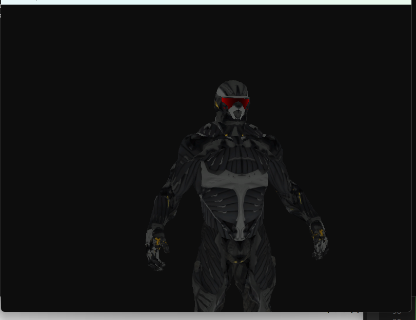
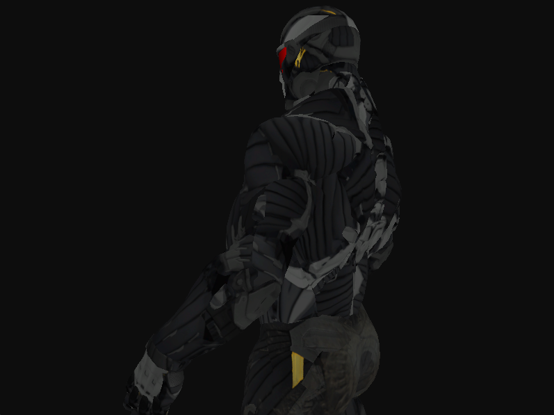
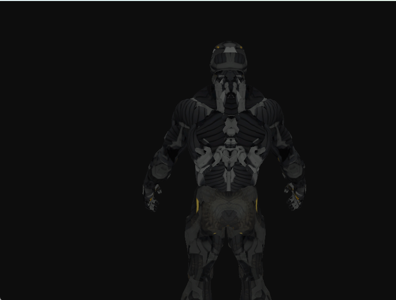
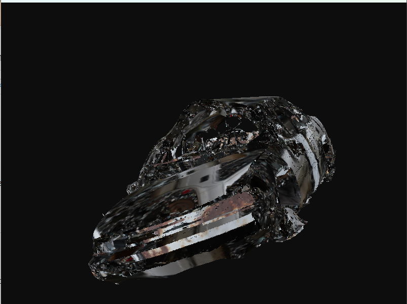
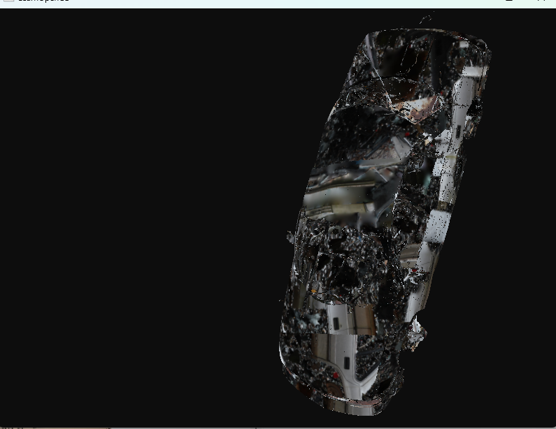
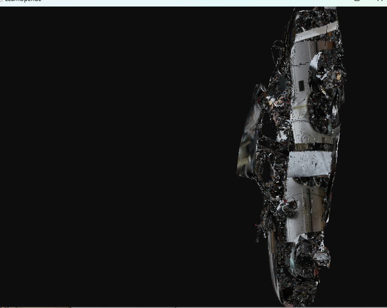

# 作业三：加载复杂3D模型

## 参考教程

跟着LearnOpenGL CN一步一步使用Assimp加载了一个复杂模型。网址：[LearnOpenGL](https://learnopengl-cn.github.io/03%20Model%20Loading/03%20Model/)

## 实现目标

+ 该项目使用Assimp来加载模型，并将其转换成Mesh对象。

+ 可以使用w,a,s,d移动camera。加载Crytek的游戏孤岛危机(Crysis)中的原版[纳米装](http://tf3dm.com/3d-model/crysis-2-nanosuit-2-97837.html)(Nanosuit)。
+ 从[sketchfab](https://sketchfab.com/) 中找到其他的3d模型进行更换加载。找到的是一辆经过车祸的轿车。

## 项目运行结果

