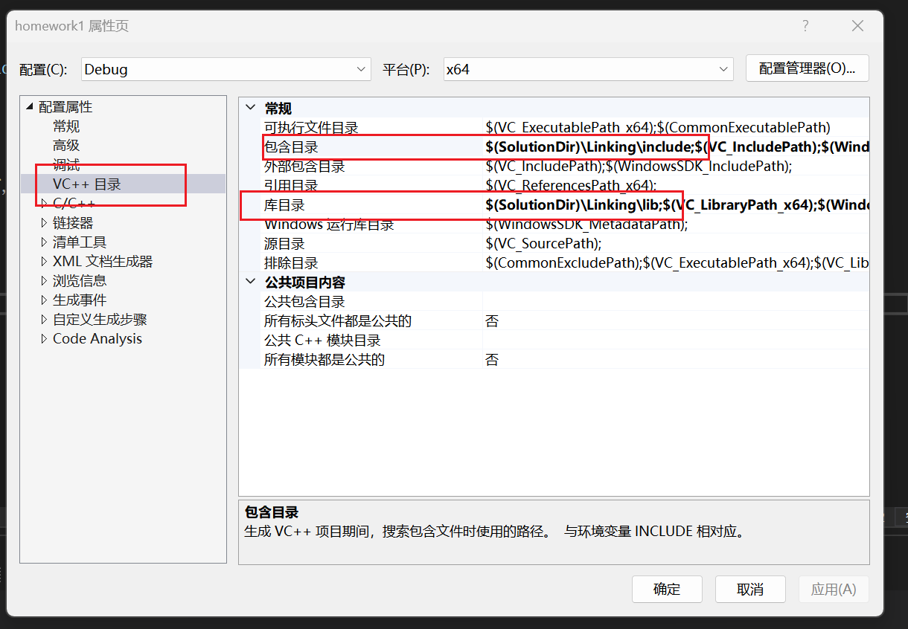
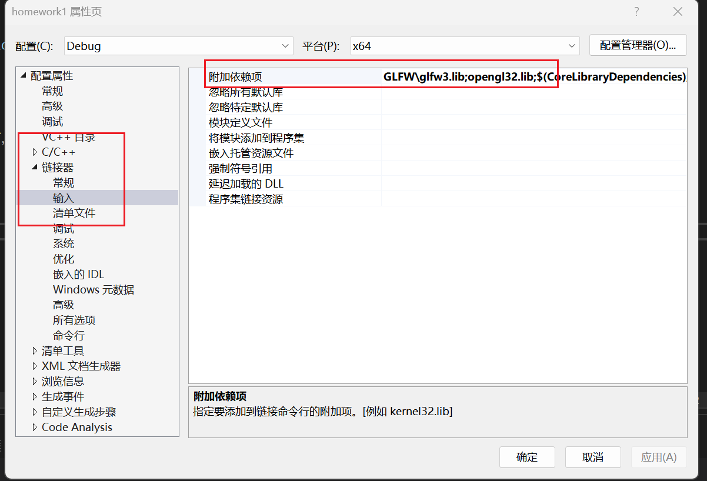
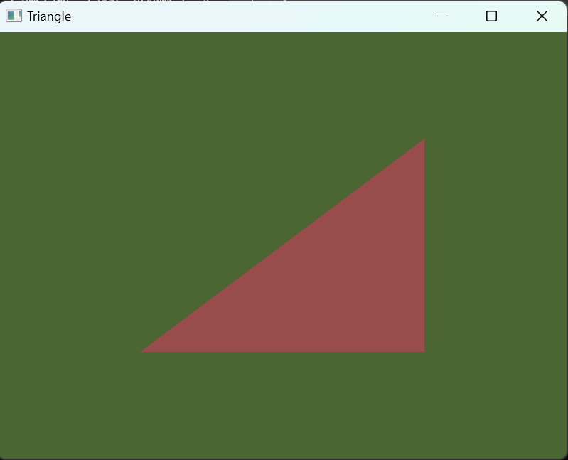
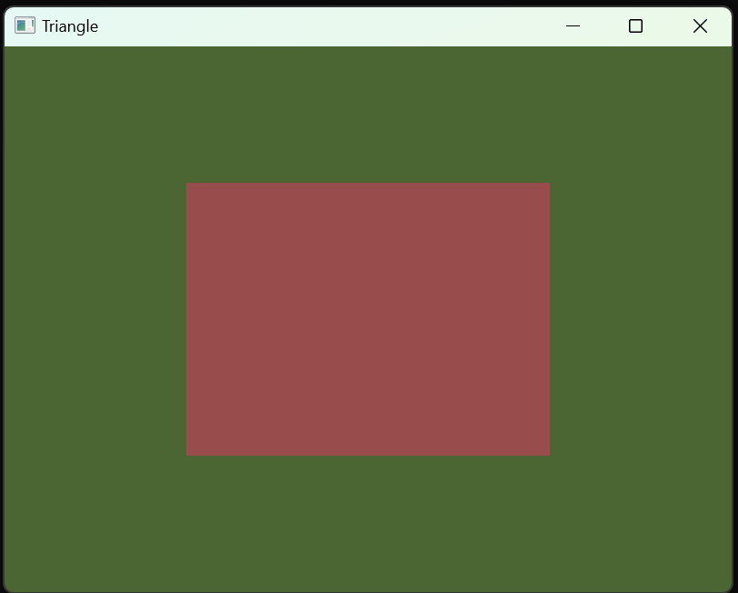

# 作业一

- [x] 搭建OpenGL编程环境
- [x] 绘制简单的图形 

## 环境

- OS: Windows 11
- IDE: Visual Studio 2022
- glad：[在线平台](https://glad.dav1d.de/)自动生成
- GLFW：64-bit version3.4
- 技术文档：[LearnOpenGL CN](https://learnopengl-cn.github.io])

## 配置过程

### 1. 新建Visual Studio工程

创建一个空的控制台C++程序。

### 2. 配置OpenGL开发环境

+ 将**GLFW**中的`include`和`lib-vc2022`分别移动到工程文件夹`include`和`libs`中

+ 将**glad**中的`include`文件夹移动到工程文件夹中的`include`

+ 配置项目属性。在如下图所示的地方，添加对应的工程include和lib，并在第二张图的位置添加依赖项：`opengl32.lib;glfw.lib`存放的具体文件夹。

+ 其中填写的地址皆为工程中具体存放相应lib的位置。以具体工程为主。

	



## 运行程序

### 1. 编写一个简单的三角形程序

+ 具体代码在工程中的`main.cpp`

+ 运行程序如下所示

	

### 2. 绘制正方形

+ 修改顶点数组为6个顶点数据

	```cpp
	float vertices[] = {
	    // 第一个三角形
	    -0.5f, -0.5f, 0.0f,  // 左下角
	     0.5f, -0.5f, 0.0f,  // 右下角
	     0.5f,  0.5f, 0.0f,  // 右上角
	
	    // 第二个三角形
	    -0.5f, -0.5f, 0.0f,  // 左下角
	     0.5f,  0.5f, 0.0f,  // 右上角
	    -0.5f,  0.5f, 0.0f   // 左上角
	};
	
	```

+ 修改 `glDrawArrays` 函数的绘制参数

	`6`表示的绘制的顶点个数

	```cpp
	glDrawArrays(GL_TRIANGLES, 0, 6);
	```

+ 运行结果：

	