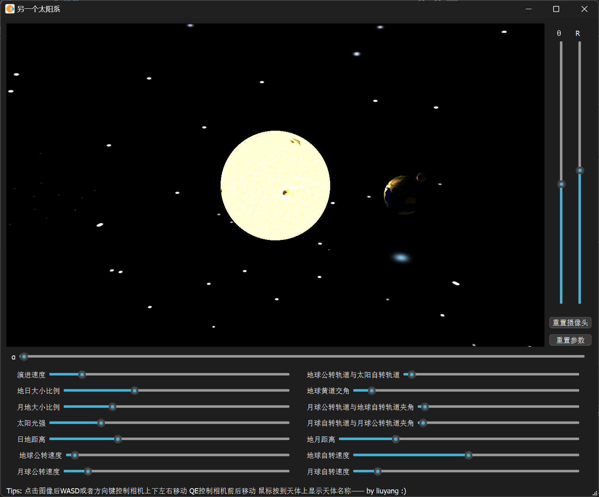
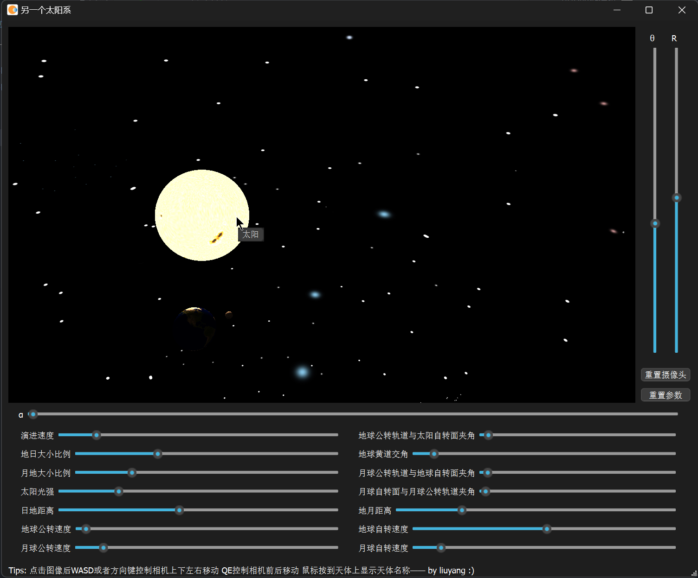
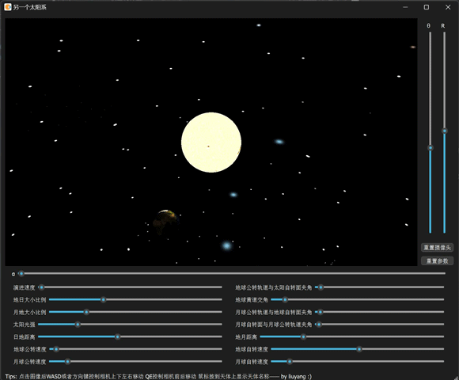

# 作业二
## 必选
- [x] 绘制太阳、地球、月球
- [x] 太阳光照
- [x] 使用图片纹理

## 可选
- [x] 使用顶点着色器和片段着色器
- [x] 鼠标选择，点击不同球体显示不同名称

## 环境
- OS: Windows 11
- IDE: Qt Creator 13.0.2
- Qt: 6.8.0
- Compiler: MinGW 13.1.0 64bit

## 实现效果
最终的界面如下图所示 



主要实现的功能有：

- 太阳、地球、月球纹理绘制
- 自定义着色器实现光照：
    - 地球、月亮采用冯氏光照模型
    - 以太阳中心点为点光源
    - 太阳模型自发光
- 模型旋转：

    - 太阳自转
    - 地球公转
    - 地球自转
    - 月球公转
    - 月球自转
- 天空穹顶：以我[自己绘制的星空](./images/background.jpg)为背景，更加真实
- 可控的摄像机


- `WASD`或者方向键可以控制摄像机上下左右移动
- `QE`可以控制摄像机前后移动
- 鼠标滚轮调整可视角度
- `α`滑动条调整摄像机水平环绕
- `θ`滑动条调整摄像机垂直环绕
- `R`滑动条调整摄像机

- 可实时调节参数：
    - 演进速度
    - 太阳和地球的大小比例
    - 地球和月亮的大小比例
    - 日地距离
    - 地月距离
    - 太阳光强
    - 地球公转速度
    - 地球自转速度
    - 月球公转速度
    - 月球自转速度
    - 地球公转轨道与太阳自转面夹角
    - 地球黄道交角
    - 月球公转轨道与地球自转面夹角
    - 月球自转面与月球公转轨道夹角
- 鼠标点按天体显示天体名称





更多演示效果可自行下载[Release](https://github.com/Quakso/graphics2024/releases/tag/1.0)尝试，目前仅有Win64版本

## 实现细节

#### 着色器

地球和月亮使用着色器`./shaders/sphere.vert`和`./shaders/sphere.vert`
主要实现顶点经过模型矩阵、视角矩阵、投影矩阵的变换和传入法线、光源位置和摄像机位置等信息后光照下的片段颜色计算。
```glsl
#version 330 core
layout (location = 0) in vec3 aPos;  // 点位置
layout (location = 1) in vec3 aNormal; // 法线
layout (location = 2) in vec2 aTexCoord; // 纹理
out vec3 fragNormal;
out vec3 fragPosition;
out vec2 texCoord;
uniform mat4 model;
uniform mat4 view;
uniform mat4 projection;
void main()
{
    fragNormal = mat3(transpose(inverse(model))) * aNormal;
    fragPosition = vec3(model*vec4(aPos, 1.0));
    texCoord = aTexCoord;
    gl_Position = projection*view*model*vec4(aPos, 1.0f);
}
```

```glsl
#version 330 core
in vec3 fragNormal;
in vec3 fragPosition;
in vec2 texCoord;
out vec4 FragColor;
uniform vec3 lightPos;
uniform vec3 viewPos;
uniform vec3 lightColor;
uniform sampler2D ourTexture;
void main()
{
    vec3 textureColor=texture(ourTexture,texCoord).rgb;
    vec3 norm = normalize(fragNormal);
    vec3 lightDir = normalize(lightPos - fragPosition);
    vec3 viewDir = normalize(viewPos - fragPosition);
    float diff = max(dot(norm, lightDir), 0.0);
    vec3 reflectDir = reflect(-lightDir, norm);
    float spec = pow(max(dot(viewDir, reflectDir), 0.0), 256.0);
    vec3 ambient = 0.04 * lightColor;
    vec3 diffuse = diff * lightColor;
    vec3 specular = spec * lightColor;
    vec3 result = (ambient + diffuse + specular) * textureColor;
    FragColor = vec4(result, 1.0f);
}
```
太阳和天空穹顶共用着色器程序`./shaders/sun.vert`和`./shaders/sun.vert`。
相对简单，未考虑其受到光照，但是叠加了一层自发光。

```glsl
#version 330 core
in vec2 texCoord;
out vec4 FragColor;
uniform sampler2D ourTexture;
uniform vec3 emissiveColor;
void main()
{
    vec3 textureColor=texture(ourTexture,texCoord).rgb;
    vec3 result = textureColor+emissiveColor; // 叠加自发光
    FragColor = vec4(result, 1.0f);
}
```

在`OpenGLWidget`初始化函数`initializeGL`中加载着色器，`paintGL`中分别渲染。

#### 球体数据生成
球体顶点、法线、纹理坐标数据由 [`generateSphere(float radius, int numLatitudes, int numLongitudes)`](https://github.com/Quakso/graphics2024/blob/a73c6621638932821c671382cb4f3f833559ac3a/22451034liuyang/homework_2/openglwidget.cpp#L396)函数生成。

经纬分段数越大，越接近球。

`initializeGL`中将这些数据存放方式告诉着色器程序。

#### 模型旋转

实现旋转就是记录转动角度，每次绘制增加转动角度（调节速度就是增加转动的角度），然后在模型矩阵上施加旋转矩阵。
难点在于如何正确地施加变换矩阵，使得模型最终呈现出想要的效果（尤其是月亮，需要谨慎考虑）。
我的实现如下：

```C++

earth_model.setToIdentity();
earth_model.scale(earth_sun_radius_ratio);
earth_model.rotate(solar_axial_tilt,0,1,0);
earth_model.rotate(earth_revolve_angle,0,0,1);
earth_model.translate(sun_earth_distance/earth_sun_radius_ratio,0,0);
earth_model.rotate(-earth_revolve_angle,0,0,1); //消除公转角速度
earth_model.rotate(earth_obliquity_of_the_ecliptic,1,0,0); // 地球黄道夹角，可能不太对,这里只是简单模拟一下
earth_model.rotate(earth_rot_angle,0,0,1);

// ...

moon_model.setToIdentity();
moon_model.scale(earth_sun_radius_ratio*moon_earth_radius_ratio);
moon_model.rotate(solar_axial_tilt,0,1,0);
moon_model.rotate(earth_revolve_angle,0,0,1);
moon_model.translate(sun_earth_distance/(earth_sun_radius_ratio*moon_earth_radius_ratio),0,0); //移动到地球的位置
moon_model.rotate(-earth_revolve_angle,0,0,1);
moon_model.rotate(earth_obliquity_of_the_ecliptic,1,0,0);
moon_model.rotate(moon_earth_obliquity_of_the_ecliptic,1,0,0); // 月球轨道和地球自转平面夹角
moon_model.rotate(moon_revolve_angle,0,0,1);
moon_model.translate(earth_moon_distance/(earth_sun_radius_ratio*moon_earth_radius_ratio),0,0);
moon_model.rotate(-moon_revolve_angle,0,0,1); // 消去公转
moon_model.rotate(moon_obliquity_of_the_ecliptic,1,0,0);
moon_model.rotate(moon_rot_angle,0,0,1);

// ...


// 太阳
sun_model.setToIdentity();
sun_model.rotate(sun_rot_angle,0,0,1);

```

#### 天空穹顶

可以理解为在外圈套了一层壳。
和太阳绘制方式一样，只不过放大了一些倍数并使用了星空的纹理图片。

#### 相机移动

相机移动主要影响了视图矩阵`view`。`view`在每次绘制使用了QMatrix4x4的`lookAt`函数，传入了**相机位置**，**相机朝向**和**相机上方**这三个向量进行变换。
这三个向量的计算过程如下，由`updateCamera`函数完成。

```C++
void OpenGLWidget::updateCamera(){
    const float epi=0.001f;
    cameraPos=QVector3D(
        cameraTarget.x()+camera_radius*qCos(camera_theta)*qSin(camera_alpha),
        cameraTarget.y()-camera_radius*qCos(camera_theta)*qCos(camera_alpha),
        cameraTarget.z()+camera_radius*qSin(camera_theta));
    cameraDirection=cameraPos-cameraTarget;
    // 注意当 camera的朝向和水平重合会出现无法计算叉积的情况，那么就要另外计算
    cameraDirection.normalize();
    if(abs(camera_theta-M_PI)<epi||abs(camera_theta)<epi||abs(camera_theta-2*M_PI)<epi){
        // theta 接近 0 PI 2PI 三种情况
        // 0, 2PI 算一组
        // PI 算一组
        if(abs(camera_theta-M_PI)>M_PI/2){
            cameraRight=QVector3D::crossProduct({0.0F,0.0F,-1.0f},cameraDirection);
        }else{
            cameraRight=QVector3D::crossProduct({0.0F,0.0F,1.0f},cameraDirection);
        }
    }else{
        QVector3D normal(qSin(camera_alpha),-qCos(camera_alpha),0.0f);
        if(camera_theta>M_PI) normal=-normal;
        cameraRight=QVector3D::crossProduct(normal,cameraDirection);

    }
    cameraUp=QVector3D::crossProduct(cameraDirection,cameraRight);
    cameraRight.normalize();
    cameraUp.normalize();
}
```

监听滚轮事件修改相机的FOV

```C++
void OpenGLWidget::wheelEvent(QWheelEvent * event){
    int delta = event->angleDelta().y();  // 获取垂直滚动增量，单位是1/8度
    if (delta > 0) {
        camera_fov+=CAMERA_FOV_VEL;
        if(camera_fov>MAX_CAMERA_FOV) camera_fov=MAX_CAMERA_FOV;
    } else if (delta < 0) {
        camera_fov-=CAMERA_FOV_VEL;
        if(camera_fov<MIN_CAMERA_FOV) camera_fov=MIN_CAMERA_FOV;
    }
}
```

监听键盘事件修改相机目标
```
void OpenGLWidget::keyPressEvent(QKeyEvent *event){
    switch(event->key()){
    case Qt::Key_W:
    case Qt::Key_Up:  //上
        cameraTarget+=cameraUp*CAMERA_VEL;
        break;
    case Qt::Key_S:
    case Qt::Key_Down: // 下
        cameraTarget+=-cameraUp*CAMERA_VEL;
        break;
    case Qt::Key_D:
    case Qt::Key_Right: // 右
        cameraTarget+=cameraRight*CAMERA_VEL;
        break;
    case Qt::Key_A:
    case Qt::Key_Left: // 左
        cameraTarget+=-cameraRight*CAMERA_VEL;
        break;
    case Qt::Key_Q: // 拉近
        cameraTarget+=-cameraDirection*CAMERA_VEL;
        break;
    case Qt::Key_E: // 远离
        cameraTarget+=cameraDirection*CAMERA_VEL;
        break;
    }
}
```

接收相机水平环绕角、垂直环绕角、环绕半径改变信号的槽。
```C++
void OpenGLWidget::onCameraAlphaChanged(int value){
    camera_alpha=2*M_PI*(float)value/360;
}

void OpenGLWidget::onCameraThetaChanged(int value){
    camera_theta=2*M_PI*(float)value/360;
}

void OpenGLWidget::onCameraRadiusChanged(int value){
    camera_radius=MAX_CAMERA_RADIUS*(float)value/100;
}
```

#### 鼠标点选

单独实现一个着色器，着色器会接受`code`值，然后给片段绘制`code`对应的颜色。
为每个物体提供不同的`code`值进行绘制，鼠标点击时`glReadPixel`获取鼠标所在位置的颜色`code`值即可知道点的是哪个物体。
注意，**单独开出一块帧缓存绘制各个天体**，不显示在屏幕上。
```glsl
#version 330
out vec4 FragColor;
uniform int code;
void main()
{
    FragColor = vec4(code/255.0F,0.0f,0.0f,0.0f); // code在R位置上
}
```
```C++
void OpenGLWidget::mousePressEvent(QMouseEvent * event){
    unsigned char res[4];
    float screen_pixel_ratio=screen()->devicePixelRatio(); // 屏幕的分辨率缩放
    QPoint mousePos = event->pos();
    glBindFramebuffer(GL_FRAMEBUFFER, pickFBO);  //  物体选择帧缓冲
    glReadPixels(mousePos.x()*screen_pixel_ratio,(height()-mousePos.y())*screen_pixel_ratio,1,1,GL_RGBA,GL_UNSIGNED_BYTE,&res);
    switch(res[0]) {
        case 0:
            qDebug()<<"Nothing Picked";
            break;
        case SUN_CODE:
            QToolTip::showText(event->globalPosition().toPoint(), "太阳");
            break;
        case EARTH_CODE:
            QToolTip::showText(event->globalPosition().toPoint(), "地球");
            break;
        case MOON_CODE:
            QToolTip::showText(event->globalPosition().toPoint(), "月亮");
            break;
        default:
            qDebug()<<res[0] <<"unrecognized";
            break;
    }
}
```

#### 其他

所有可调节的参数都是可修改的变量，主要利用了Qt的信号和槽机制将界面交互与这些变量值的改变联系起来。

## 展望

- 可以进一步修改太阳的着色器实现边缘发光柔和，更加具有真实感。
- 可以进一步实现月亮对地球的阴影遮挡。
