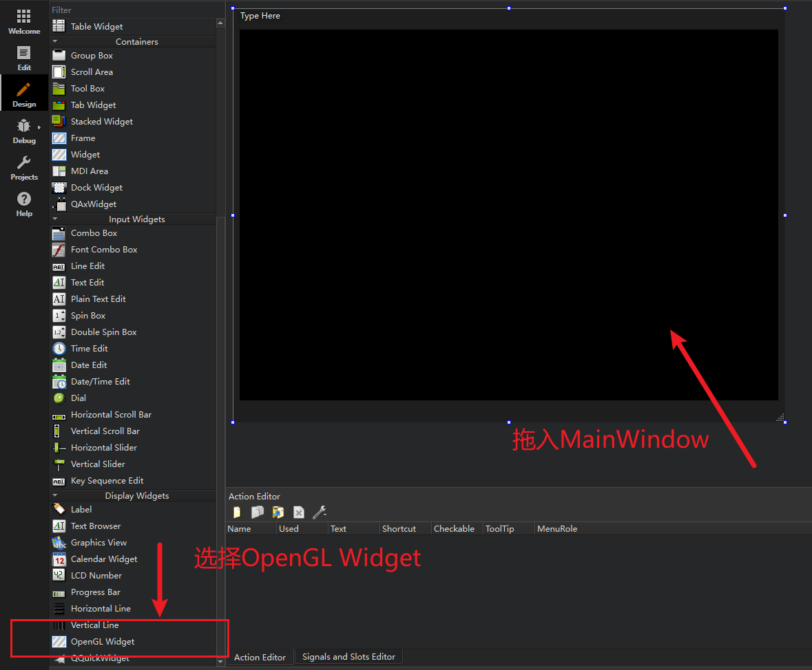
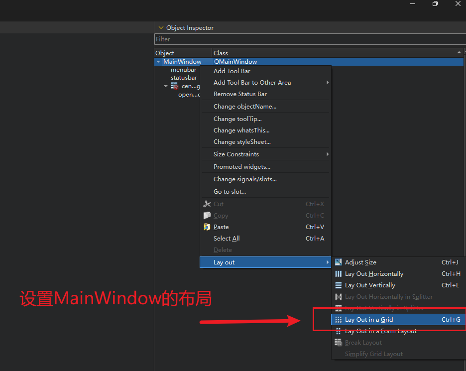

# 作业一
- [x] 搭建OpenGL编程环境
- [x] 绘制简单的图形 

## 环境
- OS: Windows 11
- IDE: Qt Creator 13.0.2
- Qt: 6.8.0
- Compiler: MinGW 13.1.0 64bit

基于 Qt 框架完成，有 [Qt OpenGL](https://doc.qt.io/qt-6/qtopengl-index.html) 库支持，使用方法参考了其文档

自定义的`OpenGLWidget`继承了`QOpenGLWidget`

## 实现
主要的绘制图形代码如下
```C++
void OpenGLWidget::initializeGL(){
    initializeOpenGLFunctions();
    glClearColor(0.0, 0.0, 0.0, 1.0); // 设置清除颜色（黑色）
}

void OpenGLWidget::paintGL()
{
    glClear(GL_COLOR_BUFFER_BIT | GL_DEPTH_BUFFER_BIT); // 清除颜色和深度缓冲区
    glLoadIdentity(); // 重置当前指定的矩阵为单位矩阵
    // 绘制一个三角形
    glBegin(GL_TRIANGLES);
    glColor3f(1.0, 0.0, 0.0); // 红色
    glVertex3f(-0.5, -0.5, 0.0);
    glColor3f(0.0, 1.0, 0.0); // 绿色
    glVertex3f(0.5, -0.5, 0.0);
    glColor3f(0.0, 0.0, 1.0); // 蓝色
    glVertex3f(0.0, 0.5, 0.0);
    glEnd();
}
```
然后，将自定义的`OpenGLWidget`放入`MainWindow`中即可。

这里我使用了 Qt Creator 提供的UI设计工具，实现步骤如下：

- 编辑`.ui`文件


- 选中`QOpenGLWidget`并拖入`MainWindow`



- 将拖入的`QOpenGLWidget` promote 为自定义的 `OpenGLWidget`


- 让`OpenGLWidget`铺满窗口，设置`MainWindow`的布局（这里随意设置成了 `Grid Layout`）



## 结果
运行结果如下图所示


