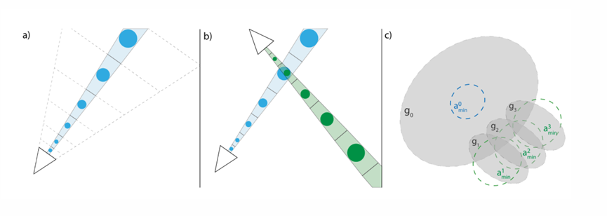
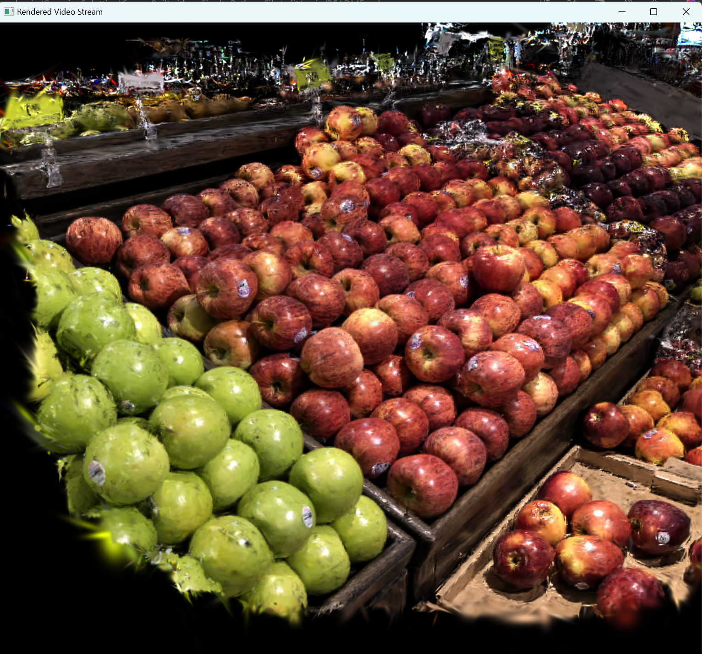
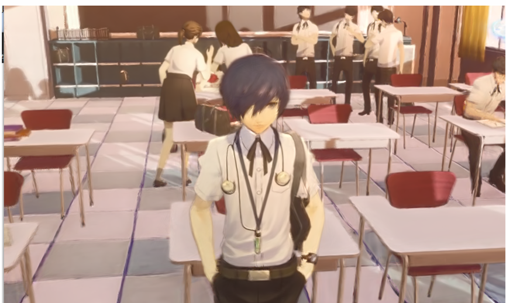
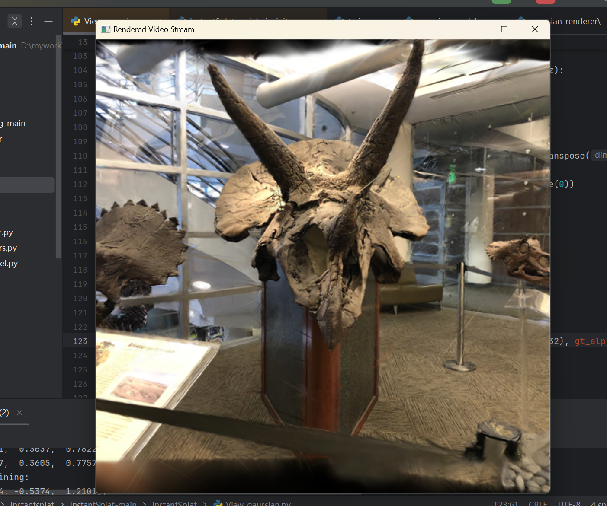
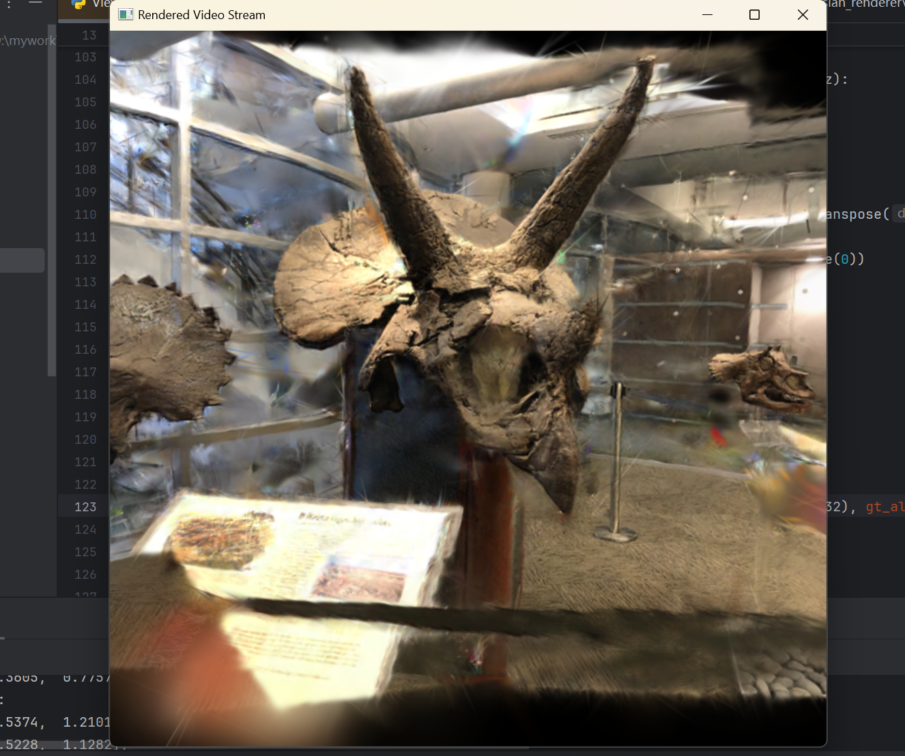
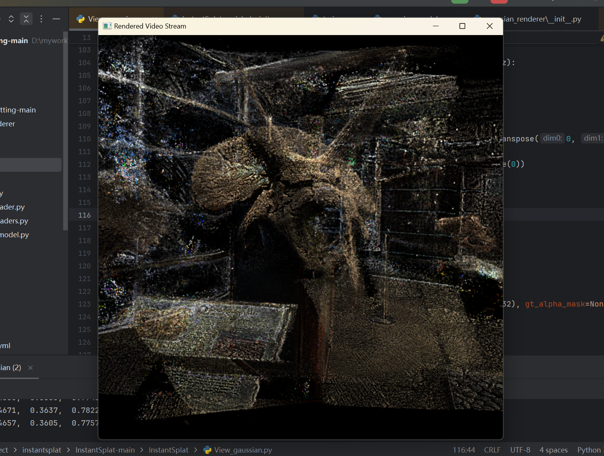

## **3D高斯泼溅内存占用的优化方法** 

我阅读了该论文并攥写了课程论文，具体内容请查看提交文件中的22451045董浩杰课程论文文件

除此之外，我编写了代码来复现该论文的创新点，相关修改代码都已提交，部分代码会写在课程论文中

复现此程序，请按照3dgs的要求配置环境，并且使用本文件下submodules中的simple-knn文件安装来替换原始文件。







**3D高斯渲染显示**
======

我创建这个文件主要是为了快速查看训练结果。这个可视化文件通过调用3dgs中的一些函数来实现可视化，因此它可以很容易地修改并在许多项目中使用。此外，该文件非常简单，允许方便地添加所需的可视化特性。







Usage
======
我在Windows系统上使用它，所以在其他系统上可能会有问题。

除了3dgs所需的环境外，还需要安装OpenCV

```python
pip install opencv-python
```

将文件中的检查点更改为要可视化的PLY文件的路径。
```python
checkpoint = "your address" 
```

启动程序
```
python Visual_Gaussian.py
```

使用W、A、S、D、Q、E控制摄像机移动，使用J、K、L、I、U、O控制摄像机视图移动。

使用-和=来控制高斯核的大小。

使用C退出屏幕。

