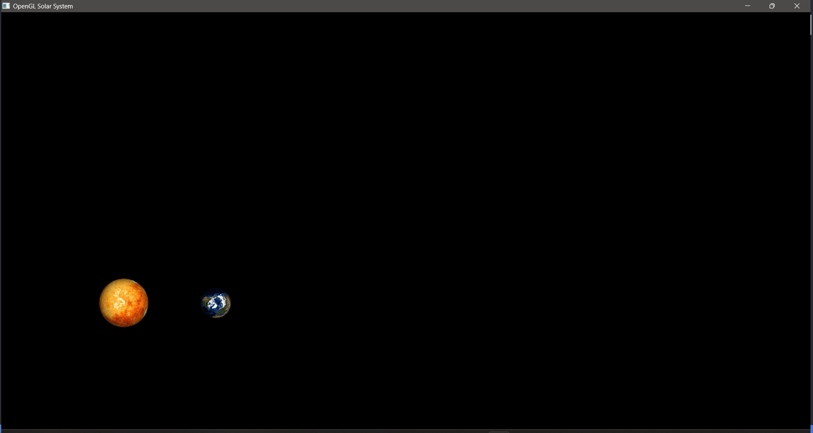

# OpenGL 项目报告

## 项目概述

本项目使用 OpenGL 创建一个简单的太阳系模型，包括太阳和地球两个天体，具体实现了以下功能：

- **纹理映射**：给太阳和地球应用了高分辨率的纹理图。
- **光照效果**：设置了一个模拟太阳光源的光照，增强视觉效果。
- **交互控制**：通过鼠标和键盘输入控制视角。

## 技术细节

### 光源设置

光源被设置在场景中，模拟太阳光的效果，代码片段如下：

```py
glLightfv(GL_LIGHT0, GL_POSITION, light_position);
glLightfv(GL_LIGHT0, GL_DIFFUSE, [1.0, 1.0, 1.0, 1.0]);
glLightfv(GL_LIGHT0, GL_SPECULAR, [1.0, 1.0, 1.0, 1.0]);
```

### 纹理映射

```py
image = Image.open(file_path)
img_data = np.array(list(image.getdata()), np.uint8)
glTexImage2D(GL_TEXTURE_2D, 0, GL_RGB, image.width, image.height, 0, GL_RGB, GL_UNSIGNED_BYTE, img_data);
```

## 结果展示


