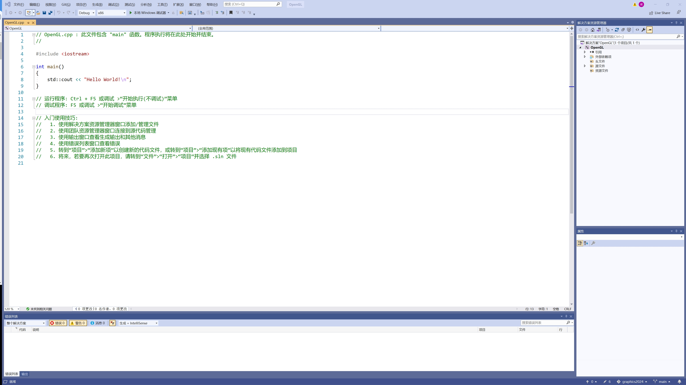
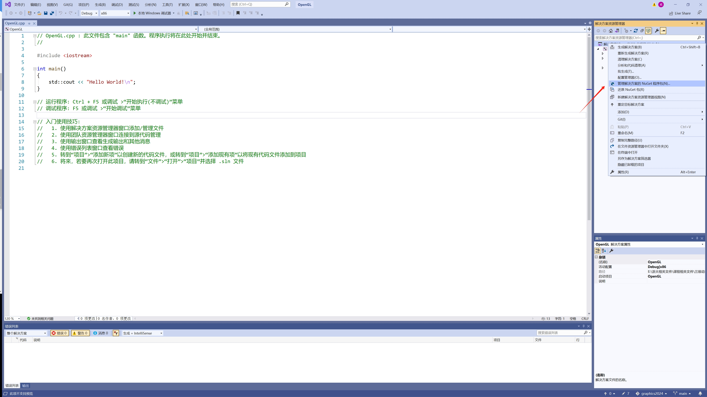
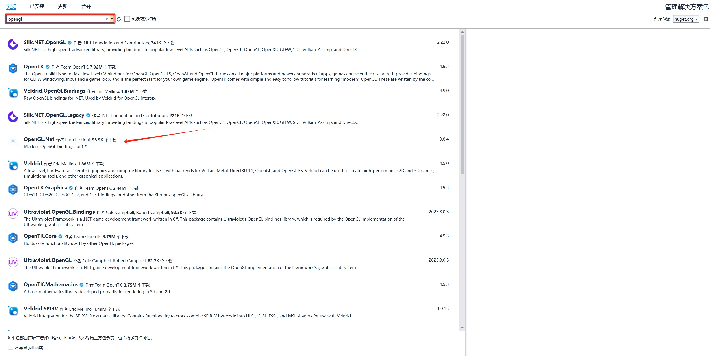
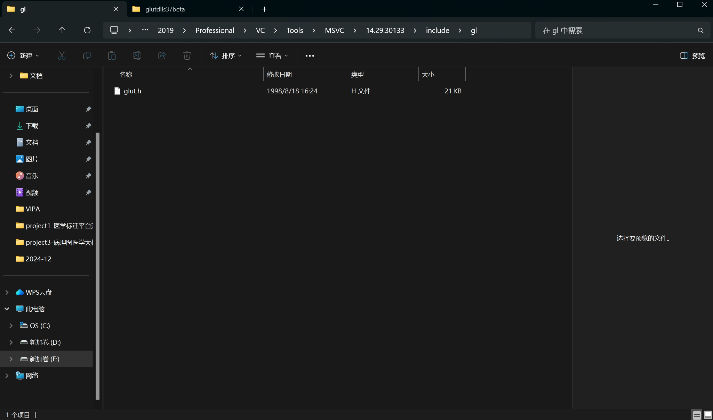
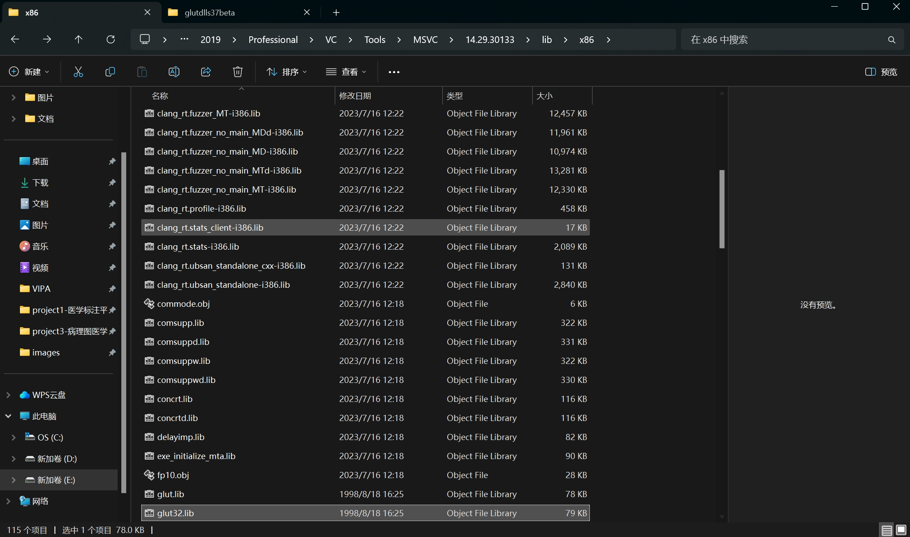
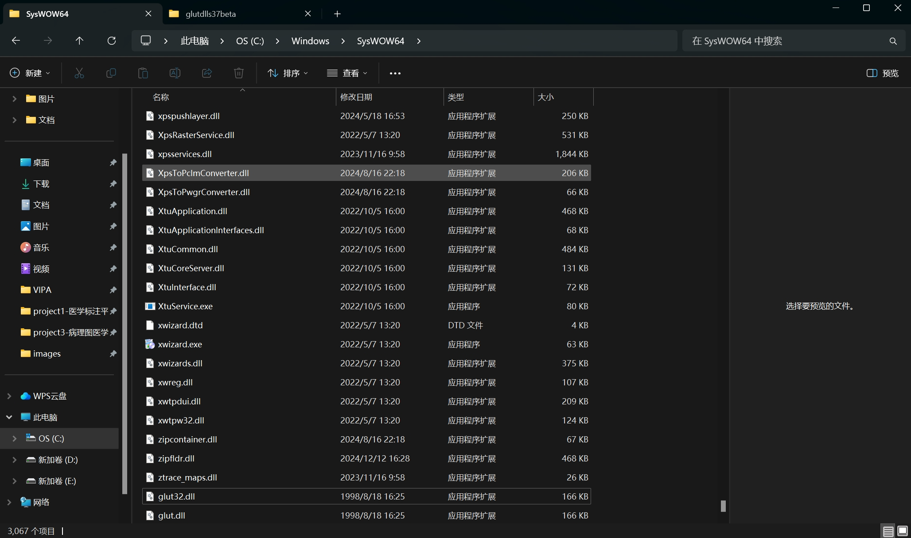
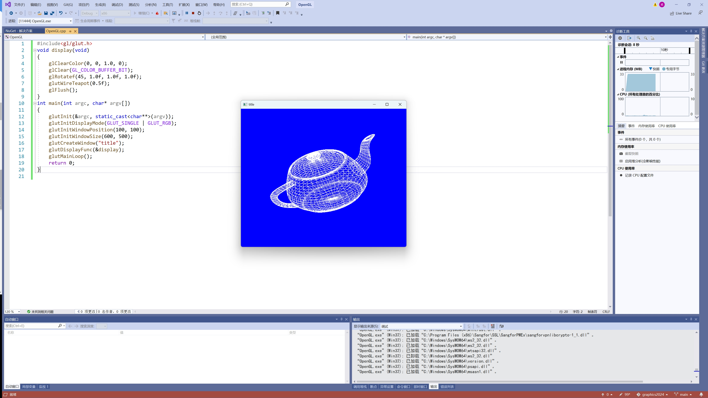
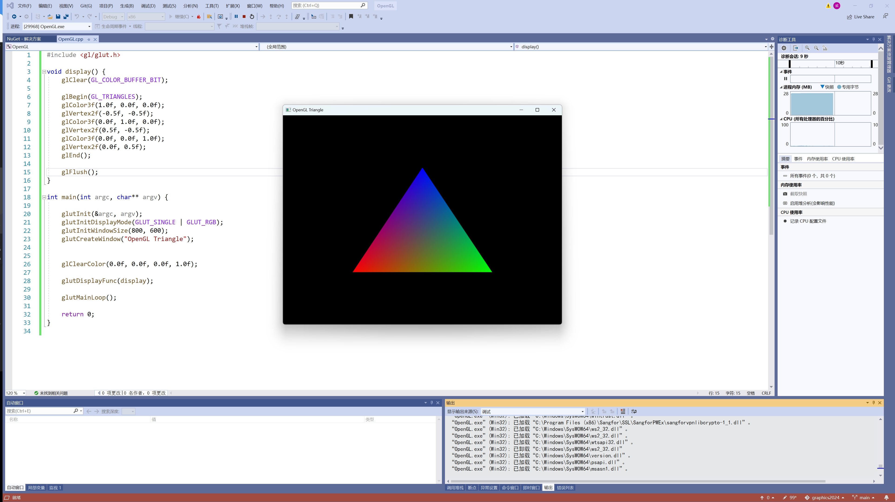
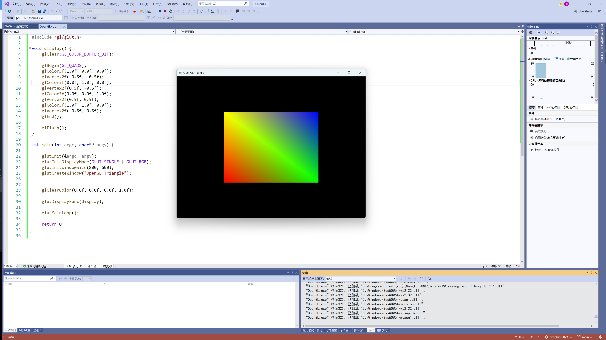

# 作业一
## 作业要求
- [ ] 1.搭建OpenGL编程环境
- [ ] 2.绘制简单图形
## 环境
| **类别** | **信息** |
| :----:  | :----: |
| 操作系统  | Windows 11 |
| IDE      | Visual Studio 2019 |
| 显卡 | NVIDIA Geforce RTX 4060 |
| CUDA | CUDA 12.5, Driver 556.12 |
| GCC | gcc version 8.1.0 (x86_64-win32-seh-rev0, Built by MinGW-W64 project) |
| 扩展 | GLM, Soil2, Glut |
## 1.搭建OpenGL编程环境
1.1 新建OpenGL项目，如图1-1所示\
 \
1.2 对解决方案点击右键，并选择管理NuGet程序包，如图1-2所示
 \
1.3 分别搜索glm, soil2, glut进行安装，如图1-3所示 \
 \
1.4 安装结果如图1-4所示 \
 \
1.5 下载Glut压缩包-glutdlls37beta.zip, 分别将.h文件, .lib文件和.dll文件放到Visual Studio安装文件的include文件夹的gl文件夹, lib文件夹和系统盘的SysWOW64文件夹下，分别如图1-5, 图1-6和图1-7所示 \
 \
 \
 \
1.6 运行下方代码
```cpp
#include<gl/glut.h>

void display(void)
{
	glClearColor(0, 0, 1.0, 0);
	glClear(GL_COLOR_BUFFER_BIT);
	glRotatef(45, 1.0f, 1.0f, 1.0f);
	glutWireTeapot(0.5f);
	glFlush();
}

int main(int argc, char* argv[])
{
	glutInit(&argc, static_cast<char**>(argv));
	glutInitDisplayMode(GLUT_SINGLE | GLUT_RGB);
	glutInitWindowPosition(100, 100);
	glutInitWindowSize(600, 500);
	glutCreateWindow("title");
	glutDisplayFunc(&display);
	glutMainLoop();
	return 0;
}
```
得到如图1-8结果, 证明OpenGL环境部署完成。


## 2.绘制简单图形
2.1 绘制三角形
运行下方代码
```cpp
#include <gl/glut.h>

void display() {
    glClear(GL_COLOR_BUFFER_BIT);

    glBegin(GL_TRIANGLES);
    glColor3f(1.0f, 0.0f, 0.0f); 
    glVertex2f(-0.5f, -0.5f); 
    glColor3f(0.0f, 1.0f, 0.0f); 
    glVertex2f(0.5f, -0.5f);  
    glColor3f(0.0f, 0.0f, 1.0f);
    glVertex2f(0.0f, 0.5f);
    glEnd();

    glFlush();
}

int main(int argc, char** argv) {

    glutInit(&argc, argv);
    glutInitDisplayMode(GLUT_SINGLE | GLUT_RGB);
    glutInitWindowSize(800, 600);
    glutCreateWindow("OpenGL Triangle");


    glClearColor(0.0f, 0.0f, 0.0f, 1.0f);

    glutDisplayFunc(display);

    glutMainLoop();

    return 0;
}
```
得到如图2-1所示结果

2.2 绘制正方形
运行下方代码
```cpp
#include <gl/glut.h>

void display() {
    glClear(GL_COLOR_BUFFER_BIT);

    glBegin(GL_QUADS);
    glColor3f(1.0f, 0.0f, 0.0f); 
    glVertex2f(-0.5f, -0.5f);  
    glColor3f(0.0f, 1.0f, 0.0f); 
    glVertex2f(0.5f, -0.5f);   
    glColor3f(0.0f, 0.0f, 1.0f); 
    glVertex2f(0.5f, 0.5f);  
    glColor3f(1.0f, 1.0f, 0.0f); 
    glVertex2f(-0.5f, 0.5f);  
    glEnd();

    glFlush();
}

int main(int argc, char** argv) {

    glutInit(&argc, argv);
    glutInitDisplayMode(GLUT_SINGLE | GLUT_RGB);
    glutInitWindowSize(800, 600);
    glutCreateWindow("OpenGL Triangle");


    glClearColor(0.0f, 0.0f, 0.0f, 1.0f);

    glutDisplayFunc(display);

    glutMainLoop();

    return 0;
}
```
得到如图2-2所示结果


