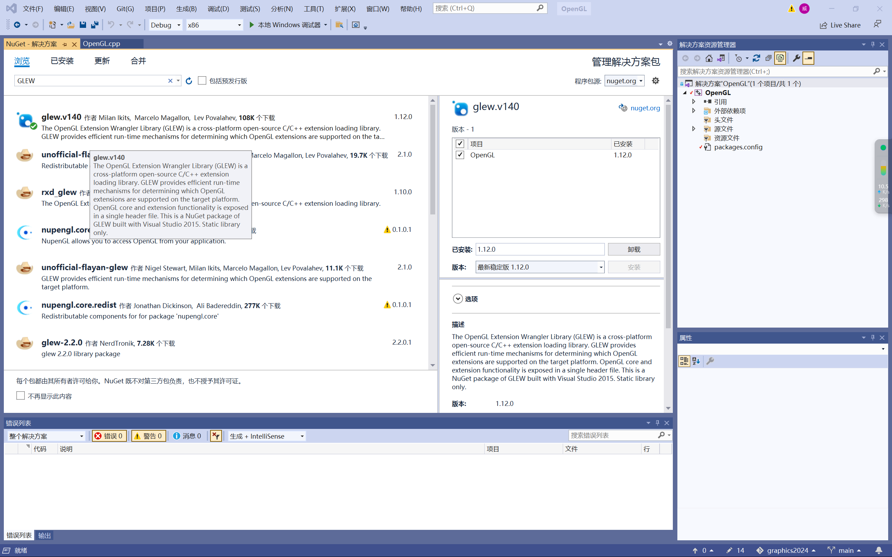
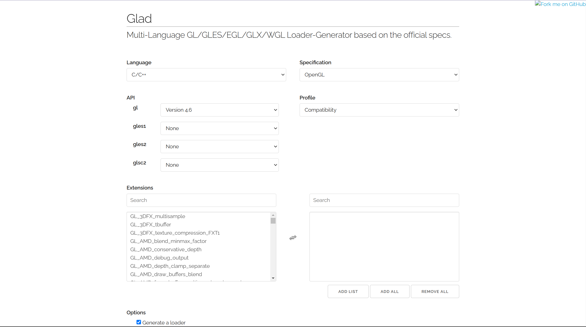
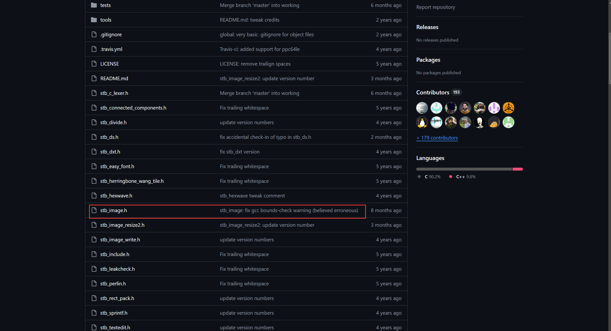
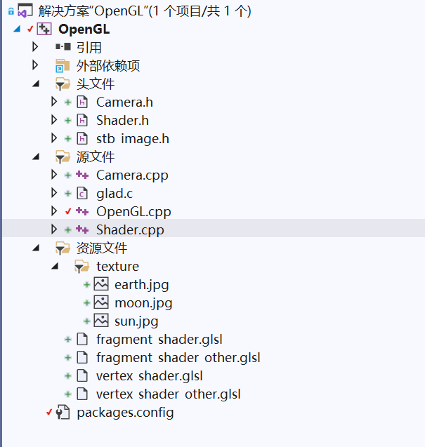

# 作业二
## 作业要求
### 必选特性
- [x] 绘制太阳, 地球和月球, 并以太阳为光源
- [x] 使用图片作为纹理
### 可选特性
- [x] 使用顶点着色器和片段着色器实现光照效果
- [x] 鼠标选择, 点击不同球体显示不同名称
## 环境
| **类别** | **信息** |
| :----:  | :----: |
| 操作系统  | Windows 11 |
| IDE      | Visual Studio 2019 |
| 显卡 | NVIDIA Geforce RTX 4060 |
| CUDA | CUDA 12.5, Driver 556.12 |
| GCC | gcc version 8.1.0 (x86_64-win32-seh-rev0, Built by MinGW-W64 project) |
| 扩展 | GLFW, Glad, stb_image.h |
## 作业演示demo


## 1.扩展安装
1.1 安装GLFW, 与作业一相同, 在GNuGet程序包管理中下载
<center>
    
    <br>
    <div style="color:orange; border-bottom: 1px solid #d9d9d9;
    display: inline-block;
    color: #999;
    padding: 2px;">
      图1-1 安装GLFW
  	</div>
</center>
1.2 安装Glad, 在https://glad.dav1d.de/中，按照图1-2选项进行下载，将include文件夹放置到Visual Studio安装文件的include文件夹，将.c文件放置到项目的源文件夹中
<center>
    
    <br>
    <div style="color:orange; border-bottom: 1px solid #d9d9d9;
    display: inline-block;
    color: #999;
    padding: 2px;">
      图1-2 安装Glad
  	</div>
</center>
1.3 配置stb_image.h头文件, 在https://github.com/nothings/stb中下载stb_image.h头文件, 并加入到项目的头文件夹中
<center>
    
    <br>
    <div style="color:orange; border-bottom: 1px solid #d9d9d9;
    display: inline-block;
    color: #999;
    padding: 2px;">
      图1-3 引入stb_image.h
  	</div>
</center>

## 2.编辑着色器, 加载纹理并配置光源
2.1 创建vertex_shader.glsl文件和fragment_shader.glsl文件，这里以太阳为例

```cpp
// vertex_shader.glsl
#version 420 core

layout(location = 0) in vec3 aPos;
layout(location = 1) in vec3 aNormal;
layout(location = 2) in vec2 aUV;
layout(std140, binding = 2) uniform PMatrix
{
    mat4 view;
    mat4 projection;
};
out VS_OUT
{
    vec2 vUV;
} vs_out;

uniform mat4 model;
void main()
{
    vs_out.vUV = aUV;

    gl_Position = projection * view * model * vec4(aPos, 1.0);
}
```

```cpp
// fragment_shader.glsl
#version 420 core

layout(location = 0) out vec4 FragColor;
layout(location = 1) out int outID;
in VS_OUT
{
    vec2 vUV;
} fs_in;

uniform sampler2D sphereTex;
uniform int objID;
void main()
{
    vec4 color = texture(sphereTex, fs_in.vUV);
    FragColor = vec4(pow(color.rgb, vec3(1.0 / 2.2)), 1.0);
    outID = objID;
}
```
2.2 分别在源文件和头文件加入Shader.cpp和Shader.h, 作为着色器的加载项, 同时设置Camera.cpp和Camera.h控制摄像头, 将纹理图片放置到资源文件中
<center>
    
    <br>
    <div style="color:orange; border-bottom: 1px solid #d9d9d9;
    display: inline-block;
    color: #999;
    padding: 2px;">
      图2-1 环境所需文件
  	</div>
</center>
2.3 主要渲染逻辑被写在OpenGL.cpp文件中

## 3.加入鼠标点击回调
3.1 使用下方函数, 实现鼠标选择, 点击不同球体显示不同名称
```cpp
void mouseClickCallback(GLFWwindow* window, int button, int action, int mods) {
	if (button == GLFW_MOUSE_BUTTON_LEFT && action == GLFW_PRESS) {
		double xpos, ypos;
		glfwGetCursorPos(window, &xpos, &ypos);

		// 获取视口和投影矩阵
		int viewport[4];
		glGetIntegerv(GL_VIEWPORT, viewport);
		glm::mat4 projection = mainCamera.getPerspective((float)SCREENWIDTH / (float)SCREENHEIGHT);
		glm::mat4 view = mainCamera.getViewMatrix();

		// 转换鼠标坐标到 NDC (Normalized Device Coordinates)
		float ndcX = (2.0f * (float)xpos) / (float)viewport[2] - 1.0f;
		float ndcY = 1.0f - (2.0f * (float)ypos) / (float)viewport[3];
		float ndcZ = 0.0f; // 假设深度值接近前方

		// 转换为世界坐标
		glm::vec4 clipCoords = glm::vec4(ndcX, ndcY, -1.0f, 1.0f);
		glm::vec4 eyeCoords = glm::inverse(projection) * clipCoords;
		eyeCoords = glm::vec4(eyeCoords.x, eyeCoords.y, -1.0f, 0.0f);

		glm::vec4 worldCoords = glm::inverse(view) * eyeCoords;
		glm::vec3 rayDirection = glm::normalize(glm::vec3(worldCoords));

		// 假设相机位置为光线的起点
		glm::vec3 rayOrigin = mainCamera.getPosition();

		// 检测光线与球体是否相交
		struct Sphere {
			glm::vec3 center;
			float radius;
			std::string name;
		};
		Sphere spheres[] = {
			{ glm::vec3(-60.0f, 10.0f, 0.0f), 30.0f, "Sun" },
			{ glm::vec3(0.0f, 0.0f, 0.0f), 10.0f, "Earth" },
			{ glm::vec3(20.0f, 0.0f, -10.0f), 5.0f, "Moon" }
		};

		for (const auto& sphere : spheres) {
			glm::vec3 oc = rayOrigin - sphere.center;
			float a = glm::dot(rayDirection, rayDirection);
			float b = 2.0f * glm::dot(oc, rayDirection);
			float c = glm::dot(oc, oc) - sphere.radius * sphere.radius;
			float discriminant = b * b - 4 * a * c;

			if (discriminant > 0) {
				std::cout << "Clicked on: " << sphere.name << std::endl;
				break;
			}
		}
	}
}
```
