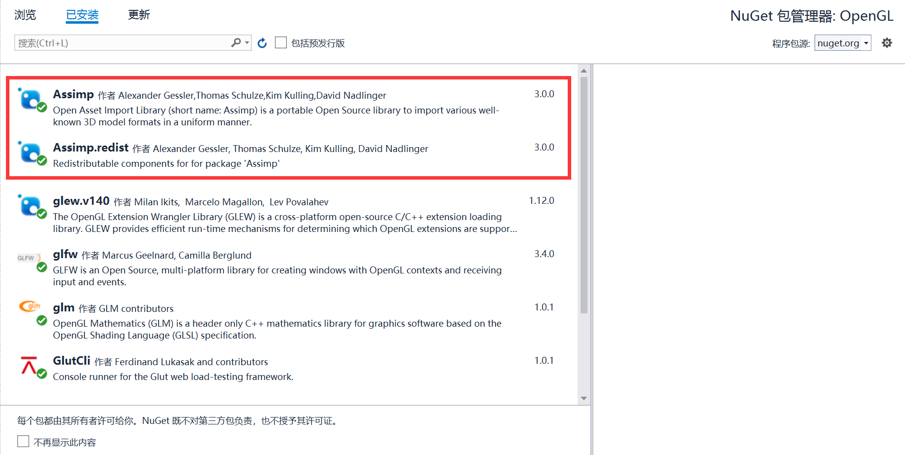

# 作业三
## 作业要求
- [x] 支持OBJ文件
- [x] 支持多个光源的光照效果，使用着色器渲染
- [x] 支持多种视点浏览方式
  - [x] 1.以模型为中心的平移旋转和缩放
  - [x] 2.以视点为中心的场景漫游 
## 环境
| **类别** | **信息** |
| :----:  | :----: |
| 操作系统  | Windows 11 |
| IDE      | Visual Studio 2019 |
| 显卡 | NVIDIA Geforce RTX 4060 |
| CUDA | CUDA 12.5, Driver 556.12 |
| GCC | gcc version 8.1.0 (x86_64-win32-seh-rev0, Built by MinGW-W64 project) |
| 扩展 | GLFW, ASSIMP, stb_image.h |
## 作业演示demo
如果视频无法加载, 可以访问https://raw.githubusercontent.com/Lweihan/graphics2024/refs/heads/main/22451077%E6%9D%8E%E5%A8%81%E7%BF%B0/images/homework3_demo.gif


## 1.扩展安装
1.1 安装ASSIMP, 与作业一相同, 在GNuGet程序包管理中下载
<center>
    
    <br>
    <div style="color:orange; border-bottom: 1px solid #d9d9d9;
    display: inline-block;
    color: #999;
    padding: 2px;">
      图1-1 安装ASSIMP
  	</div>
</center>

## 2.Obj文件读取
2.1 使用下方代码实现Obj文件的读取
```cpp
std::vector<Vertex> loadModel(const char* path) {
    std::vector<Vertex> vertices;
    Assimp::Importer importer;

    // 使用 Assimp 加载模型
    const aiScene* scene = importer.ReadFile(path, aiProcess_Triangulate | aiProcess_FlipUVs);

    if (!scene || scene->mFlags & AI_SCENE_FLAGS_INCOMPLETE || !scene->mRootNode) {
        std::cerr << "Error: Assimp could not load model!" << std::endl;
        return vertices;
    }

    aiMesh* mesh = scene->mMeshes[0];  // 假设只有一个网格

    // 获取顶点数据
    for (unsigned int i = 0; i < mesh->mNumVertices; i++) {
        Vertex vertex;
        vertex.position = glm::vec3(mesh->mVertices[i].x, mesh->mVertices[i].y, mesh->mVertices[i].z);

        if (mesh->HasNormals()) {
            vertex.normal = glm::vec3(mesh->mNormals[i].x, mesh->mNormals[i].y, mesh->mNormals[i].z);
        }

        if (mesh->mTextureCoords[0]) {
            vertex.texCoords = glm::vec2(mesh->mTextureCoords[0][i].x, mesh->mTextureCoords[0][i].y);
        }
        else {
            vertex.texCoords = glm::vec2(0.0f, 0.0f);
        }

        vertices.push_back(vertex);
    }

    return vertices;
}
```
## 3.多光源的设置
3.1 使用下方代码实现多光源的光照效果
```cpp
// 设置光源
struct Light {
    glm::vec3 position;
    glm::vec3 color;
    float intensity;
};

Light lights[3] = {
    {{1.0f, 1.0f, 1.0f}, {1.0f, 1.0f, 1.0f}, 1.0f},
    {{-1.0f, 1.0f, 1.0f}, {1.0f, 0.5f, 0.5f}, 0.8f},
    {{0.0f, 2.0f, -2.0f}, {0.5f, 0.5f, 1.0f}, 0.6f}
};
```
3.2 着色器设置, 创建vertex_shader.glsl文件和fragment_shader.glsl文件
```cpp
// vertex_shader.glsl
#version 420 core

layout(location = 0) in vec3 aPos;
layout(location = 1) in vec3 aNormal;
layout(location = 2) in vec3 aTangent;
layout(location = 3) in vec2 aTexCoord;
layout(std140, binding = 2) uniform PMatrix
{
    mat4 view;
    mat4 projection;
};
out VS_OUT
{
    vec3 vPos;
    vec2 vTexCoord;
    mat3 TBN;
    vec3 vNormal;
} vs_out;

uniform mat4 model;
void main()
{
    vec3 tangent = normalize(transpose(inverse(mat3(model))) * aTangent);
    vec3 normal = normalize(transpose(inverse(mat3(model))) * aNormal);
    tangent = normalize(tangent - dot(normal, tangent) * normal);

    vec3 bitangent = normalize(cross(normal, tangent));
    vs_out.TBN = mat3(tangent, bitangent, normal);

    vec4 pasPos = model * vec4(aPos, 1.0);
    vs_out.vPos = (pasPos / pasPos.w).xyz;
    vs_out.vTexCoord = aTexCoord;
    vs_out.vNormal = aNormal;
    gl_Position = projection * view * model * vec4(aPos, 1.0);
}
```

```cpp
// fragment_shader.glsl
#version 420 core
layout(location = 0) out vec4 FragColor;

in VS_OUT
{
    vec3 vPos;
    vec2 vTexCoord;
    mat3 TBN;
    vec3 vNormal;
} fs_in;

struct Texture
{
    sampler2D diffuse0;
    sampler2D specular0;
    sampler2D ambient0;
    sampler2D normal0;
    float ns;
};

struct Light
{
    vec3 position;
    vec3 color;
};

uniform Texture uTextures;
uniform vec3 camPos;
uniform Light lights[32];
uniform int lightCount;

vec3 calculateDiffuse(vec3 viewDir, vec3 diffuseAlbedo, vec3 lightDir, vec3 normal, vec3 lightColor)
{
    vec3 color = max(dot(normal, lightDir), 0.0) * lightColor * diffuseAlbedo;
    return color;
}

vec3 calculateSpecular(vec3 viewDir, vec3 specularAlbedo, vec3 lightDir, vec3 normal, vec3 lightColor, float ns)
{
    if(ns == 0)
    {
        ns = 64.0;
    }
    vec3 h = normalize(viewDir + lightDir);
    vec3 color = pow(max(dot(h, normal), 0.0), ns) * specularAlbedo * lightColor;
    return color;
}

void main()
{
    vec3 viewDir = normalize(camPos - fs_in.vPos);
    vec3 shaderColor = vec3(0.0);

    vec3 diffuseAlbedo = texture(uTextures.diffuse0 ,fs_in.vTexCoord).rgb;
    vec3 specularAlbedo = texture(uTextures.specular0, fs_in.vTexCoord).rgb;
    vec3 ambientAlbedo = texture(uTextures.ambient0, fs_in.vTexCoord).rgb;

    vec3 normal = normalize(texture(uTextures.normal0, fs_in.vTexCoord).rgb);
    normal = normalize(normal * 2.0 - 1.0);
    normal = normalize(fs_in.TBN * normal);
    for(int i = 0; i < lightCount; i++)
    {
        float distance = length(lights[i].position - fs_in.vPos);
        vec3 lightDir = normalize(lights[i].position - fs_in.vPos);
        shaderColor += calculateDiffuse(viewDir, diffuseAlbedo, lightDir, normal, lights[i].color) * (1.0 / (distance));
        shaderColor += calculateSpecular(viewDir, specularAlbedo, lightDir, normal, lights[i].color, uTextures.ns) * (1.0 / (distance));
    }

    shaderColor /= (shaderColor + vec3(1.0));
    //shaderColor = (normal * 0.5) + vec3(0.5);
    shaderColor = pow(shaderColor, vec3(1.0 / 2.2));
    FragColor = vec4(shaderColor, 1.0);
}
```
## 4.多视点浏览方式
4.1 使用下方代码实现以模型为中心的平移旋转和缩放
```cpp
struct Vertex {
    glm::vec3 position;
    glm::vec3 color;
};

// 计算模型的中心
glm::vec3 computeModelCenter(const std::vector<Vertex>& vertices) {
    glm::vec3 center(0.0f, 0.0f, 0.0f);
    for (const auto& vertex : vertices) {
        center += vertex.position;
    }
    center /= vertices.size();
    return center;
}

// 设置变换矩阵
glm::mat4 getModelTransformMatrix(const glm::vec3& modelCenter, const glm::vec3& translation, float scale) {
    // 先平移到原点
    glm::mat4 translateToOrigin = glm::translate(glm::mat4(1.0f), -modelCenter);
    
    // 然后缩放
    glm::mat4 scaleMatrix = glm::scale(glm::mat4(1.0f), glm::vec3(scale));
    
    // 最后平移回原位置
    glm::mat4 translateBack = glm::translate(glm::mat4(1.0f), modelCenter);
    
    // 综合变换矩阵
    return translateBack * scaleMatrix * translateToOrigin;
}

int main() {
    // 示例模型的顶点数据
    std::vector<Vertex> vertices = {
        {{-1.0f, -1.0f, 0.0f}, {1.0f, 0.0f, 0.0f}},
        {{ 1.0f, -1.0f, 0.0f}, {0.0f, 1.0f, 0.0f}},
        {{ 0.0f,  1.0f, 0.0f}, {0.0f, 0.0f, 1.0f}},
    };

    // 计算模型中心
    glm::vec3 modelCenter = computeModelCenter(vertices);
    std::cout << "Model center: (" 
              << modelCenter.x << ", " 
              << modelCenter.y << ", " 
              << modelCenter.z << ")" 
              << std::endl;

    // 平移向量
    glm::vec3 translation(2.0f, 3.0f, 0.0f);

    // 缩放比例
    float scale = 2.0f;

    // 获取模型的变换矩阵
    glm::mat4 modelMatrix = getModelTransformMatrix(modelCenter, translation, scale);

    // 输出变换矩阵
    std::cout << "Model Transformation Matrix:" << std::endl;
    for (int i = 0; i < 4; ++i) {
        for (int j = 0; j < 4; ++j) {
            std::cout << modelMatrix[i][j] << " ";
        }
        std::cout << std::endl;
    }

    // 在这里，你可以将 modelMatrix 传递给着色器，应用到渲染中
    return 0;
}
```
4.2 使用下方代码实现以视点为中心的场景漫游
```cpp
// 相机参数
glm::vec3 cameraPos(0.0f, 0.0f, 3.0f);  // 相机位置
glm::vec3 cameraFront(0.0f, 0.0f, -1.0f); // 相机前方的方向
glm::vec3 cameraUp(0.0f, 1.0f, 0.0f);    // 相机上方的方向

float yaw = -90.0f;  // 水平角度
float pitch = 0.0f;  // 垂直角度
float lastX = 400.0f, lastY = 300.0f;  // 上次鼠标位置
float fov = 45.0f;  // 视野角度

// 鼠标移动回调函数
void mouse_callback(GLFWwindow* window, double xpos, double ypos) {
    float xOffset = xpos - lastX;
    float yOffset = lastY - ypos;  // y轴翻转
    lastX = xpos;
    lastY = ypos;

    float sensitivity = 0.1f;  // 鼠标灵敏度
    xOffset *= sensitivity;
    yOffset *= sensitivity;

    yaw += xOffset;
    pitch += yOffset;

    if (pitch > 89.0f) pitch = 89.0f;  // 限制竖直角度
    if (pitch < -89.0f) pitch = -89.0f;

    glm::vec3 front;
    front.x = cos(glm::radians(yaw)) * cos(glm::radians(pitch));
    front.y = sin(glm::radians(pitch));
    front.z = sin(glm::radians(yaw)) * cos(glm::radians(pitch));
    cameraFront = glm::normalize(front);
}

// 键盘控制回调函数
void processInput(GLFWwindow* window, float deltaTime) {
    float cameraSpeed = 2.5f * deltaTime; // 每秒移动速度

    if (glfwGetKey(window, GLFW_KEY_W) == GLFW_PRESS)
        cameraPos += cameraSpeed * cameraFront;
    if (glfwGetKey(window, GLFW_KEY_S) == GLFW_PRESS)
        cameraPos -= cameraSpeed * cameraFront;
    if (glfwGetKey(window, GLFW_KEY_A) == GLFW_PRESS)
        cameraPos -= glm::normalize(glm::cross(cameraFront, cameraUp)) * cameraSpeed;
    if (glfwGetKey(window, GLFW_KEY_D) == GLFW_PRESS)
        cameraPos += glm::normalize(glm::cross(cameraFront, cameraUp)) * cameraSpeed;
}

int main() {
    // 初始化GLFW
    if (!glfwInit()) {
        std::cerr << "GLFW initialization failed!" << std::endl;
        return -1;
    }

    // 创建窗口
    GLFWwindow* window = glfwCreateWindow(800, 600, "Camera Demo", NULL, NULL);
    if (!window) {
        std::cerr << "Window creation failed!" << std::endl;
        glfwTerminate();
        return -1;
    }
    glfwMakeContextCurrent(window);
    glfwSetCursorPosCallback(window, mouse_callback);
    glfwSetInputMode(window, GLFW_CURSOR, GLFW_CURSOR_DISABLED);  // 隐藏并锁定鼠标

    // GLAD加载OpenGL
    if (!gladLoadGLLoader((GLADloadproc)glfwGetProcAddress)) {
        std::cerr << "GLAD initialization failed!" << std::endl;
        return -1;
    }

    glEnable(GL_DEPTH_TEST);  // 启用深度测试

    // 创建着色器程序、VBO、VAO等
    // 这里假设你已经准备好渲染所需的基本对象和着色器

    // 获取时间
    float deltaTime = 0.0f;
    float lastFrame = 0.0f;

    while (!glfwWindowShouldClose(window)) {
        // 计算帧时间
        float currentFrame = glfwGetTime();
        deltaTime = currentFrame - lastFrame;
        lastFrame = currentFrame;

        // 处理用户输入
        processInput(window, deltaTime);

        // 清空颜色和深度缓冲区
        glClearColor(0.1f, 0.1f, 0.1f, 1.0f);
        glClear(GL_COLOR_BUFFER_BIT | GL_DEPTH_BUFFER_BIT);

        // 设置视图矩阵
        glm::mat4 view = glm::lookAt(cameraPos, cameraPos + cameraFront, cameraUp);

        // 设置投影矩阵
        glm::mat4 projection = glm::perspective(glm::radians(fov), 800.0f / 600.0f, 0.1f, 100.0f);

        // 交换缓冲区
        glfwSwapBuffers(window);
        glfwPollEvents();
    }

    // 清理资源
    glfwTerminate();
    return 0;
}
```
