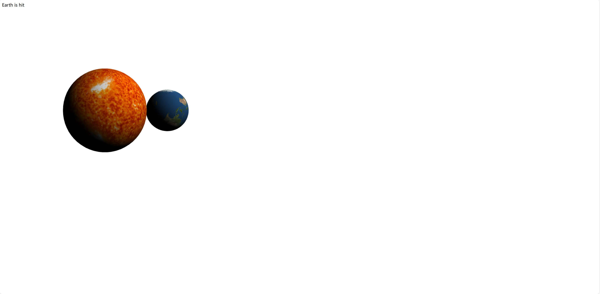

# 三维动画与交互技术第二次作业报告

## 环境配置

本项目使用了以下技术和库来创建一个WebGL应用：

- **Vue.js**: 使用Vue框架作为前端开发工具，以简化组件化开发流程。
- **TypeScript**: 为JavaScript添加静态类型检查，提高代码的可维护性。
- **gl-matrix**: 用于处理矩阵和向量运算，简化图形变换计算。
- **WebGL**: WebGL API被用来直接与浏览器的图形硬件进行交互，从而高效地渲染3D场景。

### 安装依赖项

为了运行这个项目，您需要安装Node.js以及npm（Node包管理器）。然后在项目的根目录下执行以下命令来安装所有必要的依赖项：

```bash
npm install
```

### 启动开发服务器

安装完依赖项后，可以通过以下命令启动开发服务器：

```bash
npm run dev
```

这将会启动一个本地的web服务器，您可以打开浏览器并访问提供的本地地址查看效果。

## 功能描述

### 场景概述

此项目旨在通过WebGL实现一个简单的太阳系模型，其中包含了太阳和地球两个天体。用户可以通过点击画布上的不同位置，来检测是否击中了太阳或地球，并在页面上显示相应的信息。

### 核心功能

1. **初始化WebGL环境**：当组件挂载时，会创建一个WebGL上下文，并设置视口、清除颜色等基本属性。

2. **加载纹理**：使用`initTexture`函数异步加载太阳和地球的纹理图片。

3. **创建几何形状**：`createSphere`函数负责生成球体的顶点数据，包括位置、纹理坐标和法线，这些数据会被上传到GPU以便后续绘制。

4. **着色器编程**：定义了顶点着色器和片元着色器，用于处理光照计算及材质贴图。

5. **渲染循环**：`render`函数实现了太阳和地球的渲染逻辑，分别设置了它们的位置、大小，并应用对应的纹理。

6. **交互功能**：通过监听画布上的鼠标点击事件，计算出射线并与球体进行相交测试。如果检测到用户点击了某个天体，则更新页面上的文本提示。

7. **射线投射检测**：`hitSphere`函数实现了射线与球体的碰撞检测算法，判断射线是否与给定半径的球体相交。

8. **用户反馈**：根据用户的点击行为，在界面上实时更新文字信息，告知用户是否击中了太阳或地球。

### 注意事项

- 确保所有资源文件路径正确无误，特别是纹理图片的路径。


